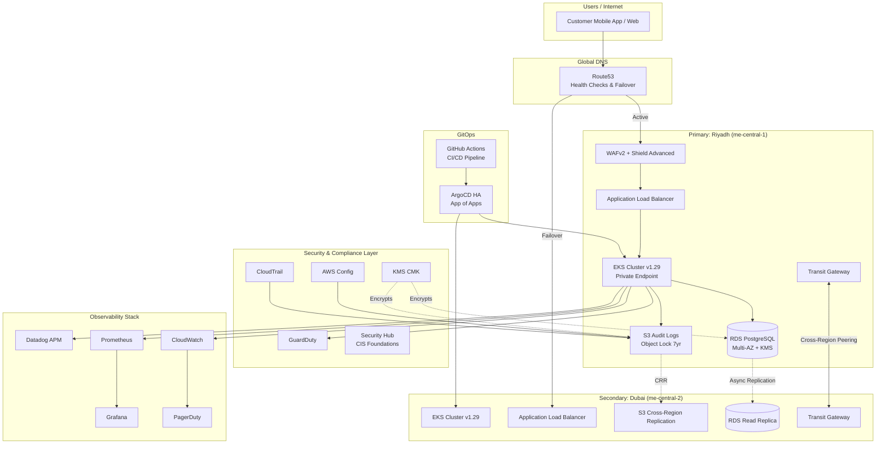

# Saudi Digital Banking Backend Infrastructure

> **Production-Grade, Multi-Region AWS Infrastructure for Simulated Digital Banking**
> **SAMA Compliance-Ready | GitOps-Driven | Zero Hardcoded Values**

---

## Table of Contents

1. [Project Overview](#project-overview)
2. [Architecture Overview](#architecture-overview)
3. [SAMA Compliance Mapping](#sama-compliance-mapping)
4. [Prerequisites](#prerequisites)
5. [Quick Start](#quick-start)
6. [Variable Configuration](#variable-configuration)
7. [Environment Strategy](#environment-strategy)
8. [Security Posture](#security-posture)
9. [Observability Guide](#observability-guide)
10. [Disaster Recovery](#disaster-recovery)
11. [Cost Optimization](#cost-optimization)
12. [Troubleshooting](#troubleshooting)
13. [Roadmap](#roadmap)

---

## Project Overview

This repository contains a **complete, production-ready, multi-region AWS infrastructure project** designed for a simulated digital banking backend operating in the Kingdom of Saudi Arabia (KSA). It is architected from the ground up to meet the stringent requirements of the **Saudi Arabian Monetary Authority (SAMA)** Cyber Security Framework, while remaining fully deployable, auditable, and maintainable by modern Platform Engineering and DevOps teams.

### What Is This Project?

This project is an **Infrastructure-as-Code (IaC) blueprint** that provisions an entire cloud-native digital banking platform across multiple AWS regions (Riyadh `me-central-1` and Dubai `me-central-2` for cross-region resiliency). It encompasses:

- **Networking**: Multi-AZ VPCs with 3-tier subnet isolation, Transit Gateway cross-region connectivity, and Route53 health checks.
- **Compute**: Amazon EKS v1.29+ with managed node groups, IRSA (IAM Roles for Service Accounts), and private endpoint-only access.
- **Security**: WAFv2 with financial-sector rule sets, AWS Shield Advanced, GuardDuty, Security Hub, and KMS CMK envelope encryption.
- **Compliance**: Centralized CloudTrail and AWS Config with S3 Object Lock (COMPLIANCE mode) enforcing 7-year immutable audit retention.
- **Database**: Multi-AZ RDS PostgreSQL 15+ with encryption, Secrets Manager auto-rotation, and performance insights.
- **Observability**: Prometheus, Grafana, CloudWatch Container Insights, Datadog APM, and PagerDuty integrations.
- **GitOps**: ArgoCD with HA Redis Sentinel, App of Apps pattern, and environment-specific ApplicationSets.

### What Does It Do?

The infrastructure serves as the foundational platform for deploying microservices-based digital banking workloads. It provides:

1. **Secure Container Orchestration**: EKS clusters hardened with Pod Security Standards (restricted), private API endpoints, and bastion-based administrative access.
2. **Defense in Depth**: Layered security from network-level geo-blocking (KSA/UAE only) and SQLi/XSS mitigation to runtime threat detection via GuardDuty.
3. **Immutable Audit Trail**: Every API call, configuration change, and data access event is logged to tamper-proof S3 buckets with Object Lock, satisfying regulatory audit requirements.
4. **Automated Delivery**: ArgoCD continuously syncs application manifests from Git, while GitHub Actions pipelines enforce SAST, container scanning, and multi-environment promotion gates.
5. **Operational Visibility**: Real-time metrics, centralized logging, and intelligent alerting ensure teams detect and respond to incidents before they impact customers.

### Why Use This Approach?

Traditional infrastructure provisioning is manual, error-prone, and nearly impossible to audit at scale. This project addresses those challenges through:

- **Variable-Driven Configuration**: Every parameter is externalized into `terraform.tfvars` files. There are zero hardcoded values in any module, enabling instant environment replication (dev → staging → prod) with full confidence.
- **Modular Architecture**: Each concern (networking, security, compliance, etc.) is encapsulated in its own Terraform module. Teams can upgrade, patch, or replace individual modules without cascading changes.
- **Compliance by Design**: SAMA requirements are not retrofitted; they are embedded into the architecture. Audit logs, encryption, access controls, and retention policies are provisioned automatically.
- **GitOps Native**: Infrastructure and application delivery are unified in Git. ArgoCD ensures the live cluster state matches the desired state declared in version control, eliminating configuration drift.
- **Cost Conscious**: Dev environments use Spot instances, while production leverages right-sized On-Demand and Savings Plans recommendations. Resource tagging is enforced for FinOps chargeback.

### Who Is This For?

This project is ideal for:

- **Cloud Architects** designing banking or fintech platforms in the Middle East.
- **DevOps / Platform Engineers** building internal developer platforms (IDPs) with strict compliance mandates.
- **Compliance Officers** seeking verifiable, code-based evidence of control implementation.
- **Recruiters & Hiring Managers** evaluating candidates for STC Pay, Urway, Tamara, or traditional bank IT departments in Riyadh and Dubai.

---

## Architecture Overview

The architecture follows an **active-passive multi-region design** optimized for the Saudi financial sector. The primary region (Riyadh) handles live traffic, while the secondary region (Dubai) serves as a warm standby for disaster recovery.

### Mermaid Diagram



### Data Flow

1. **Ingress**: Customer requests hit Route53, which routes to the Riyadh ALB. Route53 health checks monitor endpoint health; if Riyadh fails, DNS fails over to Dubai.
2. **Edge Security**: WAFv2 inspects all HTTP(S) traffic, blocking SQL injection, XSS, and requests from non-KSA/UAE IPs. AWS Shield Advanced protects against DDoS.
3. **Compute**: Traffic terminates at the ALB and is forwarded to EKS pods running in private subnets. EKS is private-endpoint only; no direct internet access to the Kubernetes API.
4. **Data**: Application pods connect to RDS PostgreSQL in database subnets. All data at rest is encrypted with KMS CMK. Secrets (DB credentials) are rotated automatically every 30 days via Secrets Manager.
5. **Audit**: Every AWS API call is recorded by CloudTrail and stored in an S3 bucket with Object Lock COMPLIANCE mode, preventing deletion or overwrite for 7 years.
6. **Observability**: Prometheus scrapes metrics, Grafana renders dashboards, Datadog collects APM traces, and CloudWatch alarms trigger PagerDuty incidents for on-call response.
7. **Delivery**: Developers push code to GitHub. Actions run build, SAST (SonarQube), container scan (Trivy), and Terraform plan. ArgoCD syncs the new manifests to the cluster.

---

## SAMA Compliance Mapping

The Saudi Arabian Monetary Authority (SAMA) Cyber Security Framework mandates specific controls for financial institutions. The following table maps each Terraform resource to its simulated SAMA requirement:

| SAMA Requirement | Control Description | Terraform Resources |
|---|---|---|
| **3.2.1** | Audit Logs Retention (7 Years) | `aws_cloudtrail.main`, `aws_s3_bucket.audit`, `aws_s3_bucket_lifecycle_configuration.audit` |
| **3.2.2** | Audit Log Integrity | `aws_s3_bucket_object_lock_configuration.audit`, `aws_s3_bucket_policy.audit_readonly_root` |
| **3.3.1** | Encryption at Rest | `aws_kms_key.main`, `aws_db_instance.main.storage_encrypted`, `aws_s3_bucket_server_side_encryption_configuration` |
| **3.3.2** | Encryption in Transit | `aws_s3_bucket_policy.audit` (TLS enforcement), ALB HTTPS listeners |
| **3.4.1** | Access Control (Least Privilege) | IRSA roles (`aws_iam_role.alb_controller`, `aws_iam_role.external_dns`), `aws_iam_role.config` |
| **3.4.2** | Privileged Access Monitoring | `aws_guardduty_detector.main`, `aws_securityhub_account.main`, `aws_cloudwatch_metric_alarm.failed_logins` |
| **3.5.1** | Network Segmentation | `aws_subnet.public`, `aws_subnet.private`, `aws_subnet.database`, `aws_security_group.database` |
| **3.5.2** | Network Intrusion Detection | `aws_wafv2_web_acl.main`, `aws_guardduty_detector.main` |
| **3.6.1** | Vulnerability Management | GitHub Actions Trivy scan, `aws_securityhub_standards_subscription.fsbp` |
| **3.7.1** | Backup & Recovery | `aws_db_instance.main.backup_retention_period`, S3 versioning, DynamoDB PITR |
| **3.8.1** | Change Management | GitOps via ArgoCD, Terraform state locking (`aws_dynamodb_table`), GitHub PR reviews |
| **3.9.1** | Incident Response | PagerDuty integration, CloudWatch alarms, GuardDuty findings export |
| **3.10.1** | Business Continuity | Multi-AZ RDS, multi-region EKS, Route53 failover, cross-region S3 replication |

---

## Prerequisites

Before deploying this infrastructure, ensure the following tools are installed and configured:

| Tool | Minimum Version | Purpose |
|---|---|---|
| AWS CLI | 2.13+ | Interact with AWS APIs |
| Terraform | 1.7.0+ | Infrastructure provisioning |
| kubectl | 1.29+ | Kubernetes cluster management |
| Helm | 3.13+ | Kubernetes package management |
| GitHub CLI | 2.30+ | GitHub Actions & repository management |
| jq | 1.6+ | JSON parsing in shell scripts |
| tflint | 0.50+ | Terraform linting |
| Checkov | 3.0+ | Policy-as-code security scanning |

### AWS Account Requirements

- Access to `me-central-1` (Riyadh) and `me-central-2` (Dubai) regions.
- Service quotas: minimum 5 VPCs, 3 EKS clusters, and 5 NAT Gateways per region.
- IAM permissions to create roles, policies, KMS keys, VPCs, EKS clusters, RDS instances, and S3 buckets.
- An OIDC identity provider configured for GitHub Actions (see `policies/oidc-trust-policies.json`).

---

## Quick Start

Follow these five steps to go from `git clone` to a running infrastructure:

### Step 1: Clone the Repository

```bash
git clone https://github.com/your-org/saudi-bank-backend.git
cd saudi-bank-backend
```

### Step 2: Configure Variables

Edit `terraform/environments/dev/terraform.tfvars` (and staging/prod as needed). At minimum, update:

- `project_name`
- `common_tags` (Owner, CostCenter)
- `gitops.gitops_repo_url` (point to your Git repo)
- `state_backend.bucket_name` (globally unique S3 bucket name)
- `observability.alert_email`

### Step 3: Run Pre-Flight Checks

```bash
make preflight ENV=dev
```

This validates AWS credentials, tool versions, and service quotas.

### Step 4: Bootstrap the Backend

```bash
make bootstrap ENV=dev
```

This idempotently creates the S3 bucket and DynamoDB table for Terraform state.

### Step 5: Deploy (Two-Phase)

Because Kubernetes providers require a live cluster endpoint, deployment is split into two phases:

**Phase 1: AWS Infrastructure**
```bash
make infra ENV=dev
```

This creates VPC, subnets, EKS cluster, RDS, KMS, WAF, CloudTrail, and S3 buckets.

**Phase 2: Kubernetes Addons**
```bash
make k8s ENV=dev
```

This deploys ArgoCD, Prometheus, Grafana, and other cluster addons via Helm.

**Combined (convenience target):**
```bash
make deploy-dev
```

For staging and production:

```bash
make deploy-staging ENV=staging
make deploy-prod ENV=prod
```

**Note**: Production requires manual approval via the Makefile prompt and GitHub Environment protection rules.

---

## Variable Configuration

All variables are defined in `terraform/variables.tf` and overridden per environment in `terraform/environments/<env>/terraform.tfvars`.

| Variable | Type | Description | Example |
|---|---|---|---|
| `project_name` | `string` | Project name for resource naming | `"saudi-bank-backend"` |
| `environment` | `string` | Deployment environment | `"dev"`, `"staging"`, `"prod"` |
| `primary_region` | `string` | Primary AWS region | `"me-central-1"` |
| `secondary_region` | `string` | DR region | `"me-central-2"` |
| `networking.cidr_blocks` | `map(string)` | VPC and subnet CIDRs | `{ vpc = "10.0.0.0/16" }` |
| `networking.availability_zones` | `list(string)` | AZs for subnet distribution | `["me-central-1a", "me-central-1b"]` |
| `eks.cluster_version` | `string` | Kubernetes version | `"1.29"` |
| `eks.node_instance_types` | `list(string)` | EC2 instance types for nodes | `["t3.medium"]` |
| `eks.desired_capacity` | `number` | Desired node count | `3` |
| `security.allowed_countries` | `list(string)` | ISO country codes for WAF | `["SA", "AE"]` |
| `security.waf_rate_limit` | `number` | Requests per 5 min per IP | `3000` |
| `security.enable_shield_advanced` | `bool` | Enable AWS Shield Advanced | `true` (prod) |
| `compliance.audit_retention_years` | `number` | Audit log retention | `7` |
| `compliance.enable_object_lock` | `bool` | Enable S3 Object Lock | `true` |
| `database.db_instance_class` | `string` | RDS instance class | `"db.r6g.xlarge"` |
| `database.backup_retention` | `number` | RDS backup retention days | `35` |
| `observability.alert_email` | `string` | Alert recipient email | `"alerts@example.com"` |
| `gitops.gitops_repo_url` | `string` | ArgoCD source repository | `"https://github.com/org/repo.git"` |
| `gitops.argocd_version` | `string` | ArgoCD Helm chart version | `"5.51.6"` |
| `state_backend.bucket_name` | `string` | Terraform state S3 bucket | `"my-tfstate-bucket"` |
| `state_backend.dynamodb_table_name` | `string` | State lock table | `"my-tflock-table"` |

**Validation**: Every variable includes validation blocks (e.g., CIDR format, environment whitelist, minimum retention). Terraform will fail fast with descriptive errors if invalid values are provided.

---

## Environment Strategy

This project supports three environments: **dev**, **staging**, and **prod**.

### Isolation Model

Environments are isolated using a **combination of separate AWS accounts and VPC-level segregation**:

- **Recommended**: Use separate AWS accounts per environment (dev account, staging account, prod account). This provides the strongest blast-radius containment.
- **Alternative** (for smaller teams): Use the same AWS account but distinct VPCs with strict IAM boundaries. Each environment has its own:
  - VPC and subnet CIDR ranges (no overlap)
  - EKS cluster
  - RDS instance
  - S3 buckets (state + audit)
  - DynamoDB lock table

### Promotion Path

```
Dev (auto-deploy) -> Staging (manual approval) -> Prod (two-person approval + 24h soak)
```

- **Dev**: Every merge to `main` auto-deploys. Spot instances minimize cost.
- **Staging**: Requires manual approval in GitHub Actions. Mirrors production sizing.
- **Production**: Requires two reviewers and a 24-hour staging stability observation.

### Backend Separation

Each environment has its own S3 state bucket and DynamoDB lock table, preventing state corruption and enabling parallel environment management.

---

## Security Posture

Security is not an afterthought; it is woven into every layer of this architecture.

### Defense in Depth

1. **Perimeter**: WAFv2 geo-blocks non-KSA/UAE traffic, mitigates SQLi/XSS, and rate-limits IPs.
2. **Network**: 3-tier VPC isolation (Public / Private / Database). Private subnets have no direct internet egress except via NAT Gateway. Database subnets are completely isolated.
3. **Compute**: EKS private endpoint only. Bastion host is required for administrative kubectl access. Nodes use IAM roles with least-privilege policies.
4. **Identity**: IRSA assigns fine-grained IAM roles to individual Kubernetes service accounts. No node-level AWS credentials are mounted into pods.
5. **Data**: All data at rest is encrypted with KMS CMK. RDS uses envelope encryption. S3 buckets enforce TLS-only transport.
6. **Audit**: CloudTrail logs every API call. GuardDuty detects anomalous behavior. Security Hub aggregates findings against CIS benchmarks.

### IRSA (IAM Roles for Service Accounts)

Instead of granting broad EC2 instance profile permissions to all pods, each workload receives its own IAM role:

- **ALB Controller**: Can manage ELBs, target groups, and security groups.
- **External-DNS**: Can modify Route53 hosted zones.
- **Cert-Manager**: Can create Route53 DNS records for ACME challenges.
- **Cluster Autoscaler**: Can scale Auto Scaling Groups tagged for the cluster.

No role has `*:*` permissions. All policies are scoped to the minimum required actions.

### Encryption Strategy

- **At Rest**: KMS CMK (multi-region in prod) encrypts EKS secrets, RDS storage, EBS volumes, and S3 objects.
- **In Transit**: TLS 1.2+ enforced on ALBs, S3 bucket policies, and API endpoints.
- **Key Rotation**: KMS automatic key rotation is enabled.

---

## Observability Guide

### Accessing Dashboards

After deployment, retrieve access credentials and endpoints:

| Tool | Access Method | Command |
|---|---|---|
| **Grafana** | Port-forward | `kubectl port-forward svc/kube-prometheus-stack-grafana -n monitoring 3000:80` |
| **ArgoCD** | Port-forward | `make argocd-login` |
| **CloudWatch** | AWS Console | Navigate to CloudWatch > Dashboards |
| **PagerDuty** | Web | Log in to your PagerDuty tenant |

### Sample Alert Queries

**High CPU in EKS Nodes** (PromQL):
```promql
100 - (avg by(instance) (irate(node_cpu_seconds_total{mode="idle"}[5m])) * 100) > 80
```

**5xx Errors on ALB** (CloudWatch Metrics):
```
Namespace: AWS/ApplicationELB
MetricName: HTTPCode_Target_5XX_Count
Statistic: Sum
Period: 60
Threshold: > 10
```

**Failed Login Attempts** (CloudWatch Logs Insights):
```sql
fields @timestamp, @message
| filter @message like /Failed login/
| stats count() as failed_attempts by bin(5m)
| filter failed_attempts > 5
```

### Datadog APM

The Datadog agent runs as a DaemonSet. It pulls the API key from AWS Secrets Manager (referenced by `var.observability.datadog_api_key_secret_arn`). Deploy the agent via the Helm chart in `kubernetes/` after creating the secret.

---

## Disaster Recovery

### RTO / RPO Targets

| Metric | Target | Implementation |
|---|---|---|
| **RTO** (Recovery Time Objective) | < 4 hours | Multi-region EKS, Route53 failover, automated ArgoCD sync to DR |
| **RPO** (Recovery Point Objective) | < 1 hour | RDS cross-region read replica, S3 Cross-Region Replication (CRR) |

### Failover Procedure

1. **Detection**: Route53 health checks detect primary region failure.
2. **DNS Failover**: Route53 automatically updates DNS to point to the Dubai ALB.
3. **Database Promotion**: Promote the Dubai RDS read replica to standalone writer.
4. **Cluster Sync**: ArgoCD ensures the DR EKS cluster is running the same application version.
5. **Verification**: Run smoke tests against the Dubai endpoints.

### Backup Verification

- **Monthly**: Restore RDS snapshot to a temporary instance and validate connectivity.
- **Quarterly**: Perform a full DR drill, including DNS cutover and database promotion.

---

## Cost Optimization

### Right-Sizing

- **Dev**: Uses Spot instances for EKS node groups (configurable via `capacity_type`).
- **Staging**: Mirrors production topology but with smaller instance classes.
- **Production**: Uses On-Demand for stability, with Karpenter for dynamic scaling.

### Savings Plans

For production workloads with predictable baselines, purchase Compute Savings Plans for 1- or 3-year terms to reduce EC2 costs by up to 72%.

### Resource Tagging

All resources are tagged with `Project`, `Environment`, `ManagedBy`, `Owner`, and `CostCenter`. Use AWS Cost Explorer and tagging policies to allocate costs by team and environment.

### Lifecycle Policies

- S3 audit logs transition to Glacier after 90 days and Deep Archive after 180 days.
- ECR lifecycle policies automatically delete untagged images older than 30 days.

---

## Troubleshooting

### Quota Limits

**Error**: `VpcLimitExceeded`
**Fix**: Request a quota increase via AWS Service Quotas console or run:
```bash
aws service-quotas request-quota-increase --service-code ec2 --quota-code L-1194D1C8 --desired-value 10
```

### IRSA Misconfiguration

**Error**: `WebIdentityErr: failed to retrieve credentials`
**Fix**: Verify the service account annotation matches the IAM role ARN:
```bash
kubectl get sa -n kube-system aws-load-balancer-controller -o yaml
```
Ensure the OIDC provider thumbprint is up to date.

### ArgoCD Sync Failures

**Error**: `ComparisonError: failed to get resource`
**Fix**: Check cluster RBAC and ArgoCD application destination namespace:
```bash
kubectl logs -n argocd deployment/argocd-application-controller
```
Ensure the Application's `project` and `destination.server` are correct.

### Terraform State Lock

**Error**: `Error acquiring the state lock`
**Fix**: If a previous run crashed, force-unlock after confirming no active runs:
```bash
cd terraform && terraform force-unlock <LOCK_ID>
```

---

## Roadmap

This project is designed to evolve. Planned enhancements include:

1. **AWS Fargate**: Migrate non-critical workloads to Fargate profiles for serverless container execution.
2. **Chaos Engineering**: Integrate AWS Fault Injection Simulator (FIS) to test AZ failures, API throttling, and network blackholes.
3. **Service Mesh**: Deploy Istio or AWS App Mesh for mTLS between microservices and advanced traffic management.
4. **FinOps Dashboard**: Build a Grafana dashboard using CUR (Cost and Usage Report) data exported to Athena.
5. **Policy as Code**: Expand OPA (Open Policy Agent) gatekeeper policies for Kubernetes admission control.
6. **Multi-Cloud DR**: Evaluate Azure or GCP as a tertiary DR target for extreme resilience.

---

## License

This project is provided as an educational and portfolio reference. Adapt it for your organization with appropriate security reviews and penetration testing before production use in regulated environments.

---

**Built with precision for the Saudi financial sector.**
