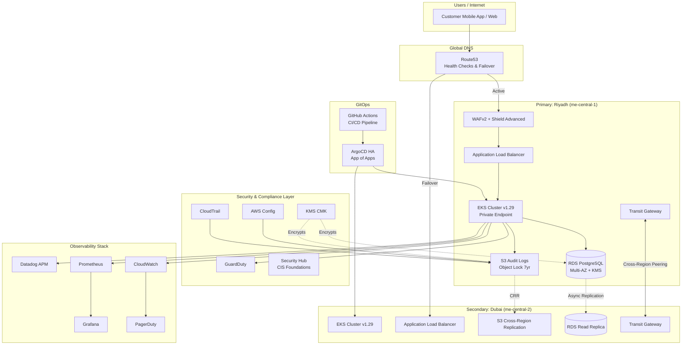

# SAMA VAULT PLATFORM

> **Production-Grade, Multi-Region AWS Infrastructure for Simulated Digital Banking**
> **SAMA Compliance-Ready | GitOps-Driven | Zero Hardcoded Values**

---

## Table of Contents
1. [Overview](#overview)
2. [Architecture Overview](#architecture-overview)
3. [SAMA Compliance Mapping](#sama-compliance-mapping)
4. [Tech Stack & Capabilities](#tech-stack--capabilities)
5. [Quick Start](#quick-start)
6. [The One File You Need to Edit](#the-one-file-you-need-to-edit)
7. [Environment Strategy](#environment-strategy)
8. [Security Posture](#security-posture)
9. [Observability Guide](#observability-guide)
10. [Disaster Recovery](#disaster-recovery)
11. [Cost Optimization](#cost-optimization)
12. [Full Walkthrough — How This Works Step by Step](#full-walkthrough--how-this-works-step-by-step)
13. [Implementation Deep Dive — Behind the Scenes](#implementation-deep-dive--behind-the-scenes)
14. [Troubleshooting](#troubleshooting)
15. [Roadmap](#roadmap)
16. [License](#license)

---

## Overview

This repository is a **complete, production-ready, multi-region AWS Infrastructure-as-Code blueprint** for a simulated digital banking backend in the Kingdom of Saudi Arabia, architected to satisfy the **SAMA (Saudi Arabian Monetary Authority) Cyber Security Framework**. Everything is provisioned via Terraform and GitOps — zero manual console clicks, zero hardcoded values, full audit trail.

At a glance, it provisions:

| Requirement | What this project builds |
| --- | --- |
| Compute | Amazon EKS v1.29+ across Riyadh (`me-central-1`) and Dubai (`me-central-2`) |
| Data | Multi-AZ RDS PostgreSQL 15+, encrypted, auto-rotated credentials |
| Perimeter security | WAFv2 (financial-sector rule sets) geo-restricted to SA/AE, Shield Advanced |
| Audit trail | CloudTrail + S3 Object Lock (COMPLIANCE mode), 7-year immutable retention |
| Encryption | KMS CMK envelope encryption, automatic annual rotation |
| Observability | Prometheus, Grafana, CloudWatch Container Insights, Datadog APM, PagerDuty |
| Delivery | ArgoCD (App of Apps, HA Redis Sentinel) + GitHub Actions CI/CD |
| DR | Active-passive cross-region failover, RTO < 4h / RPO < 1h |

**Why code instead of console clicks:** manual AWS console setup can't be repeated reliably across environments, can't be proven to an auditor, and can't be peer-reviewed. Every setting here lives in one `.tfvars` file, goes through a PR, and is applied via CI — giving full history, full audit trail, full reproducibility.

**Built for:** Cloud Architects and DevOps/Platform Engineers targeting fintech and banking infrastructure roles (STC Pay, Urway, Tamara, or traditional KSA/UAE banks), compliance teams who want working code instead of policy documents, and anyone studying how production banking infrastructure is actually built.

---

## Architecture Overview

The architecture follows an **active-passive multi-region design** optimized for the Saudi financial sector. The primary region (Riyadh) handles live traffic; the secondary region (Dubai) is a warm standby for disaster recovery.



### Data Flow

1. **Ingress**: Requests hit Route53, which routes to the Riyadh ALB. Route53 health checks fail traffic over to Dubai if Riyadh becomes unhealthy.
2. **Edge security**: WAFv2 inspects all HTTP(S) traffic, blocking SQL injection, XSS, and requests from non-KSA/UAE IPs. Shield Advanced protects against DDoS.
3. **Compute**: Traffic terminates at the ALB and forwards to EKS pods in private subnets. EKS is private-endpoint only — no direct internet access to the Kubernetes API.
4. **Data**: Pods connect to RDS PostgreSQL in isolated database subnets. All data at rest is KMS-encrypted; DB credentials rotate automatically every 30 days via Secrets Manager.
5. **Audit**: Every AWS API call is recorded by CloudTrail into an S3 bucket with Object Lock COMPLIANCE mode — undeletable, unmodifiable, for 7 years.
6. **Observability**: Prometheus scrapes metrics, Grafana renders dashboards, Datadog collects APM traces, CloudWatch alarms page on-call via PagerDuty.
7. **Delivery**: Developers push to GitHub. Actions run build → SAST (SonarQube) → container scan (Trivy) → `terraform plan`. ArgoCD syncs the resulting manifests to the cluster.

---

## SAMA Compliance Mapping

Each Terraform resource maps to a specific SAMA Cyber Security Framework control:

| SAMA Requirement | Control Description | Terraform Resources |
| --- | --- | --- |
| **3.2.1** | Audit Logs Retention (7 Years) | `aws_cloudtrail.main`, `aws_s3_bucket.audit`, `aws_s3_bucket_lifecycle_configuration.audit` |
| **3.2.2** | Audit Log Integrity | `aws_s3_bucket_object_lock_configuration.audit`, `aws_s3_bucket_policy.audit_readonly_root` |
| **3.3.1** | Encryption at Rest | `aws_kms_key.main`, `aws_db_instance.main.storage_encrypted`, `aws_s3_bucket_server_side_encryption_configuration` |
| **3.3.2** | Encryption in Transit | `aws_s3_bucket_policy.audit` (TLS enforcement), ALB HTTPS listeners |
| **3.4.1** | Access Control (Least Privilege) | IRSA roles (`aws_iam_role.alb_controller`, `aws_iam_role.external_dns`), `aws_iam_role.config` |
| **3.4.2** | Privileged Access Monitoring | `aws_guardduty_detector.main`, `aws_securityhub_account.main`, `aws_cloudwatch_metric_alarm.failed_logins` |
| **3.5.1** | Network Segmentation | `aws_subnet.public`, `aws_subnet.private`, `aws_subnet.database`, `aws_security_group.database` |
| **3.5.2** | Network Intrusion Detection | `aws_wafv2_web_acl.main`, `aws_guardduty_detector.main` |
| **3.6.1** | Vulnerability Management | GitHub Actions Trivy scan, `aws_securityhub_standards_subscription.fsbp` |
| **3.7.1** | Backup & Recovery | `aws_db_instance.main.backup_retention_period`, S3 versioning, DynamoDB PITR |
| **3.8.1** | Change Management | GitOps via ArgoCD, Terraform state locking (`aws_dynamodb_table`), GitHub PR reviews |
| **3.9.1** | Incident Response | PagerDuty integration, CloudWatch alarms, GuardDuty findings export |
| **3.10.1** | Business Continuity | Multi-AZ RDS, multi-region EKS, Route53 failover, cross-region S3 replication |

---

## Tech Stack & Capabilities

- **Networking**: Multi-AZ VPCs with 3-tier subnet isolation, Transit Gateway cross-region connectivity, Route53 health checks.
- **Compute**: Amazon EKS v1.29+ with managed node groups, IRSA, private-endpoint-only access.
- **Security**: WAFv2 (financial-sector rule sets), Shield Advanced, GuardDuty, Security Hub, KMS CMK envelope encryption.
- **Compliance**: Centralized CloudTrail + AWS Config, S3 Object Lock (COMPLIANCE mode), 7-year immutable audit retention.
- **Database**: Multi-AZ RDS PostgreSQL 15+, encrypted, Secrets Manager auto-rotation, Performance Insights.
- **Observability**: Prometheus, Grafana, CloudWatch Container Insights, Datadog APM, PagerDuty.
- **GitOps**: ArgoCD (HA Redis Sentinel, App of Apps pattern, environment-specific ApplicationSets).

**Design principles:**
- **Variable-driven configuration** — every parameter externalized to `terraform.tfvars`; zero hardcoded values in any module.
- **Modular architecture** — networking, security, compliance, database, etc. are independent Terraform modules; teams can patch one without cascading changes.
- **Compliance by design** — audit logs, encryption, access controls, and retention are provisioned automatically, not retrofitted.
- **GitOps native** — ArgoCD keeps live cluster state matched to Git, eliminating drift.
- **Cost conscious** — Spot instances in dev, right-sized On-Demand + Savings Plans in prod, enforced tagging for FinOps chargeback.

---

## Quick Start

### Prerequisites

| Tool | Minimum Version | Purpose |
| --- | --- | --- |
| AWS CLI | 2.13+ | Interact with AWS APIs |
| Terraform | 1.7.0+ | Infrastructure provisioning |
| kubectl | 1.29+ | Kubernetes cluster management |
| Helm | 3.13+ | Kubernetes package management |
| GitHub CLI | 2.30+ | GitHub Actions & repository management |
| jq | 1.6+ | JSON parsing in shell scripts |
| tflint | 0.50+ | Terraform linting |
| Checkov | 3.0+ | Policy-as-code security scanning |

AWS account also needs: access to `me-central-1` and `me-central-2`, quotas for ≥5 VPCs / 3 EKS clusters / 5 NAT Gateways per region, IAM permissions to create the relevant resource types, and an OIDC identity provider for GitHub Actions (`policies/oidc-trust-policies.json`).

### Steps

```bash
# 1. Clone
git clone https://github.com/your-org/saudi-bank-backend.git
cd saudi-bank-backend

# 2. Configure — edit ONLY terraform/environments/dev/terraform.tfvars
#    (project_name, common_tags, gitops_repo_url, state_backend.bucket_name, alert_email)

# 3. Pre-flight checks (AWS creds, tool versions, service quotas)
make preflight ENV=dev

# 4. Bootstrap Terraform state backend (S3 + DynamoDB lock table)
make bootstrap ENV=dev

# 5. Deploy — two phases, because Kubernetes providers need a live cluster endpoint
make infra ENV=dev   # VPC, EKS, RDS, KMS, WAF, CloudTrail, S3
make k8s ENV=dev     # ArgoCD, Prometheus, Grafana via Helm

# Convenience target for dev:
make deploy-dev

# Staging / prod:
make deploy-staging ENV=staging
make deploy-prod ENV=prod   # requires manual approval + GitHub Environment protection
```

Phase 1 (`make infra`) takes roughly 20–40 minutes. Production deploys require two reviewers and a 24-hour staging soak before promotion.

---

## The One File You Need to Edit

The entire project is designed so you only ever touch **one file per environment**:

```
terraform/environments/dev/terraform.tfvars
```

(and the equivalent `staging/terraform.tfvars`, `prod/terraform.tfvars`)

### Minimum changes required

```hcl
# 1. Project name — used in ALL resource names
project_name = "my-bank-name"

# 2. Team ownership tags
common_tags = {
  Owner      = "your-name"
  CostCenter = "your-team"
}

# 3. Git repo ArgoCD will watch
gitops = {
  gitops_repo_url = "https://github.com/YOUR-ORG/YOUR-REPO.git"
}

# 4. Globally unique Terraform state bucket
state_backend = {
  bucket_name         = "my-bank-name-tfstate-dev"
  dynamodb_table_name = "my-bank-name-tflock-dev"
}

# 5. Alert email
observability = {
  alert_email = "your-email@example.com"
}
```

Every other value has a sensible default and every module reads from this single file — change the EKS version once here, and it propagates everywhere, no search-and-replace across modules.

Variables are validated, not just passed through blindly:

```hcl
validation {
  condition     = var.compliance.audit_retention_years >= 7
  error_message = "SAMA compliance requires a minimum of 7 years audit retention."
}
```

### Full Variable Reference

| Variable | Type | Description | Example |
| --- | --- | --- | --- |
| `project_name` | `string` | Project name for resource naming | `"saudi-bank-backend"` |
| `environment` | `string` | Deployment environment | `"dev"`, `"staging"`, `"prod"` |
| `primary_region` | `string` | Primary AWS region | `"me-central-1"` |
| `secondary_region` | `string` | DR region | `"me-central-2"` |
| `networking.cidr_blocks` | `map(string)` | VPC and subnet CIDRs | `{ vpc = "10.0.0.0/16" }` |
| `networking.availability_zones` | `list(string)` | AZs for subnet distribution | `["me-central-1a", "me-central-1b"]` |
| `eks.cluster_version` | `string` | Kubernetes version | `"1.29"` |
| `eks.node_instance_types` | `list(string)` | EC2 instance types for nodes | `["t3.medium"]` |
| `eks.desired_capacity` | `number` | Desired node count | `3` |
| `security.allowed_countries` | `list(string)` | ISO country codes for WAF | `["SA", "AE"]` |
| `security.waf_rate_limit` | `number` | Requests per 5 min per IP | `3000` |
| `security.enable_shield_advanced` | `bool` | Enable AWS Shield Advanced | `true` (prod) |
| `compliance.audit_retention_years` | `number` | Audit log retention | `7` |
| `compliance.enable_object_lock` | `bool` | Enable S3 Object Lock | `true` |
| `database.db_instance_class` | `string` | RDS instance class | `"db.r6g.xlarge"` |
| `database.backup_retention` | `number` | RDS backup retention days | `35` |
| `observability.alert_email` | `string` | Alert recipient email | `"alerts@example.com"` |
| `gitops.gitops_repo_url` | `string` | ArgoCD source repository | `"https://github.com/org/repo.git"` |
| `gitops.argocd_version` | `string` | ArgoCD Helm chart version | `"5.51.6"` |
| `state_backend.bucket_name` | `string` | Terraform state S3 bucket | `"my-tfstate-bucket"` |
| `state_backend.dynamodb_table_name` | `string` | State lock table | `"my-tflock-table"` |

---

## Environment Strategy

Three environments: **dev**, **staging**, **prod**.

### Isolation model

- **Recommended**: separate AWS accounts per environment for the strongest blast-radius containment.
- **Alternative** (smaller teams): same account, distinct VPCs with strict IAM boundaries. Each environment still gets its own VPC/subnet CIDRs, EKS cluster, RDS instance, S3 buckets, and DynamoDB lock table.

### Promotion path

```
Dev (auto-deploy) -> Staging (manual approval) -> Prod (two-person approval + 24h soak)
```

- **Dev**: every merge to `main` auto-deploys; Spot instances minimize cost.
- **Staging**: requires manual GitHub Actions approval; mirrors production sizing.
- **Production**: requires two reviewers and a 24-hour staging stability observation.

Each environment has its own S3 state bucket and DynamoDB lock table, preventing state corruption and enabling parallel environment management.

---

## Security Posture

### Defense in depth

1. **Perimeter**: WAFv2 geo-blocks non-KSA/UAE traffic, mitigates SQLi/XSS, rate-limits IPs.
2. **Network**: 3-tier VPC isolation. Private subnets have no direct internet egress except via NAT Gateway; database subnets are fully isolated.
3. **Compute**: EKS private endpoint only; bastion host required for admin `kubectl` access; nodes use least-privilege IAM roles.
4. **Identity**: IRSA assigns fine-grained IAM roles per Kubernetes service account — no node-level AWS credentials mounted into pods.
5. **Data**: KMS CMK encryption at rest, envelope encryption for RDS, TLS-only S3 transport.
6. **Audit**: CloudTrail logs every API call; GuardDuty detects anomalies; Security Hub aggregates findings against CIS benchmarks.

### IRSA (IAM Roles for Service Accounts)

Each workload gets its own scoped IAM role instead of a broad EC2 instance profile:

- **ALB Controller** — manage ELBs, target groups, security groups
- **External-DNS** — modify Route53 hosted zones
- **Cert-Manager** — create Route53 records for ACME challenges
- **Cluster Autoscaler** — scale tagged Auto Scaling Groups

No role holds `*:*` permissions.

### Encryption strategy

- **At rest**: KMS CMK (multi-region in prod) encrypts EKS secrets, RDS storage, EBS volumes, S3 objects.
- **In transit**: TLS 1.2+ enforced on ALBs, S3 bucket policies, API endpoints.
- **Rotation**: automatic annual KMS key rotation.

---

## Observability Guide

| Tool | Access Method | Command |
| --- | --- | --- |
| Grafana | Port-forward | `kubectl port-forward svc/kube-prometheus-stack-grafana -n monitoring 3000:80` |
| ArgoCD | Port-forward | `make argocd-login` |
| CloudWatch | AWS Console | Navigate to CloudWatch > Dashboards |
| PagerDuty | Web | Log in to your PagerDuty tenant |

**High CPU on EKS nodes (PromQL):**
```promql
100 - (avg by(instance) (irate(node_cpu_seconds_total{mode="idle"}[5m])) * 100) > 80
```

**5xx errors on ALB (CloudWatch Metrics):**
```
Namespace: AWS/ApplicationELB
MetricName: HTTPCode_Target_5XX_Count
Statistic: Sum
Period: 60
Threshold: > 10
```

**Failed login attempts (CloudWatch Logs Insights):**
```sql
fields @timestamp, @message
| filter @message like /Failed login/
| stats count() as failed_attempts by bin(5m)
| filter failed_attempts > 5
```

Datadog's agent runs as a DaemonSet and pulls its API key from Secrets Manager (`var.observability.datadog_api_key_secret_arn`). Deploy it via the Helm chart in `kubernetes/` after creating the secret.

---

## Disaster Recovery

| Metric | Target | Implementation |
| --- | --- | --- |
| **RTO** | < 4 hours | Multi-region EKS, Route53 failover, automated ArgoCD sync to DR |
| **RPO** | < 1 hour | RDS cross-region read replica, S3 Cross-Region Replication (CRR) |

### Failover sequence

| Event | Automatic or Manual | Time |
| --- | --- | --- |
| Route53 detects Riyadh ALB unhealthy | Automatic | ~30 seconds |
| DNS switches to Dubai ALB | Automatic | ~60 seconds |
| Dubai EKS cluster serves traffic | Automatic (already running) | Immediate |
| DBA promotes Dubai RDS replica to writer | Manual | ~15 minutes |
| Full DR verified via smoke tests | Manual | ~30 minutes |

### Backup verification

- **Monthly**: restore an RDS snapshot to a temporary instance and validate connectivity.
- **Quarterly**: full DR drill — DNS cutover and database promotion.

---

## Cost Optimization

- **Right-sizing**: dev uses Spot instances (`capacity_type`); staging mirrors production topology at smaller instance classes; production uses On-Demand with Karpenter for dynamic scaling.
- **Savings Plans**: for predictable production baselines, 1- or 3-year Compute Savings Plans cut EC2 cost up to 72%.
- **Tagging**: every resource carries `Project`, `Environment`, `ManagedBy`, `Owner`, `CostCenter` for Cost Explorer chargeback.
- **Lifecycle policies**: S3 audit logs move to Glacier after 90 days, Deep Archive after 180 days; ECR deletes untagged images older than 30 days.

---

## Full Walkthrough — How This Works Step by Step

> A plain-language walk from `git clone` to a live, DR-capable banking backend.

### Step 1 — Configure

Open `terraform/environments/dev/terraform.tfvars` and fill in project name, primary region, node count, alert email, etc. This is the only file you touch.

### Step 2 — Pre-flight check

```bash
make preflight ENV=dev
```
Confirms AWS login, Terraform install, service quota headroom, and account permissions to create VPCs/EKS/RDS.

### Step 3 — Bootstrap state storage

```bash
make bootstrap ENV=dev
```
Creates the S3 bucket (state) and DynamoDB table (lock), named from your config — no manual naming.

### Step 4 — Phase 1: infrastructure

```bash
make infra ENV=dev
```
Builds, in order: networking (VPC, 3-tier subnets, NAT), security (WAF, GuardDuty, KMS, CloudTrail), compliance (7-year locked audit bucket, Config rules), database (encrypted PostgreSQL, 30-day credential rotation), and the private EKS cluster. Takes ~20–40 minutes.

### Step 5 — Phase 2: cluster addons

```bash
make k8s ENV=dev
```
Installs ArgoCD, Prometheus, and Grafana into the running cluster via Helm.

### Step 6 — Sync applications

```bash
make argocd-sync-dev
```
ArgoCD reads Kubernetes manifests from Git and deploys them. Every future push updates the cluster automatically — no manual deploys.

### Step 7 — Traffic path in production

Customer → Route53 → WAF (SA/AE geo-check) → Load Balancer → EKS pods → RDS PostgreSQL, with every action logged to a 7-year tamper-proof CloudTrail bucket.

### Step 8 — Continuous monitoring

Prometheus scrapes every 15 seconds, Grafana visualizes it, CloudWatch watches the AWS layer, PagerDuty pages on-call on alarm, GuardDuty watches for intrusion and exfiltration behavior.

### Step 9 — Automatic regional failover

Route53 health-checks Riyadh every 30 seconds; on failure, DNS switches to Dubai, whose EKS cluster is already running and in sync via ArgoCD, and whose RDS replica is promoted to writer.

**Result**: one config file, four commands, and you have two Kubernetes clusters, an encrypted database, a geo-restricted firewall, 7 years of immutable audit logs, automated threat detection, real-time dashboards, GitOps delivery, and automatic cross-region failover.

---

## Implementation Deep Dive — Behind the Scenes

> Every layer, and why it exists — for engineers reviewing the actual implementation.

### Layer 1 — Config → Terraform variables

```
terraform/environments/dev/terraform.tfvars
        ↓
terraform/variables.tf   (types, validation)
        ↓
terraform/main.tf        (passes values to each module)
        ↓
terraform/modules/{networking,security,compliance,database,eks,observability,gitops}/
        ↓
Running AWS infrastructure
```

Nothing is hardcoded — `main.tf` reads `var.networking.cidr_blocks`, always from your config.

### Layer 2 — Networking

```
AWS Region (me-central-1, Riyadh)
└── VPC (10.0.0.0/16)
    ├── Public Subnets (10.0.0.0/20)    ← Load Balancers
    ├── Private Subnets (10.0.16.0/20)  ← App pods
    └── Database Subnets (10.0.32.0/20) ← Isolated DB tier
```

3 Availability Zones for AZ-level fault tolerance; NAT Gateway for one-way egress; VPC Flow Logs on every packet (SAMA requirement).

### Layer 3 — Security

- **KMS**: master encryption key for DB records, S3 objects, and K8s secrets; rotates annually.
- **WAF**: geo-restricted to SA/AE, blocks SQLi/XSS, rate-limits at 3,000 req/5min/IP (configurable).
- **GuardDuty**: ML-driven analysis of CloudTrail/VPC Flow/DNS logs for anomalous API calls, known-bad IPs, crypto-mining behavior, exfiltration.
- **Security Hub**: aggregates GuardDuty/Config/Inspector findings, scores against the CIS Foundations Benchmark.

### Layer 4 — Compliance

- **CloudTrail**: every API call recorded, stored in S3 with Object Lock COMPLIANCE mode — undeletable for 7 years even by the root account. Satisfies SAMA 3.2.1/3.2.2.
- **AWS Config**: detects manual drift outside Terraform, records full resource configuration history.
- **S3 lifecycle**: Standard (0–90 days) → Glacier (90–180 days) → Deep Archive (180 days–7 years) → deleted.

### Layer 5 — Database

- **RDS PostgreSQL**: Multi-AZ in prod with ~60-second automatic failover, KMS encryption at rest, daily backups (7-day dev / 35-day prod retention), Performance Insights for query diagnostics.
- **Secrets Manager**: DB password never touches code or config; rotates every 30 days; pods retrieve it at runtime only.

### Layer 6 — EKS

- **Control plane**: private-only API server, accessed via bastion host — a stolen kubeconfig is useless without VPN/bastion access.
- **Node groups**: Spot `t3.medium` in dev, On-Demand in prod, autoscaling on load.
- **IRSA**: least-privilege IAM per workload rather than broad node-level permissions — minimizes blast radius if a pod is compromised.

### Layer 7 — Observability

Prometheus scrapes `/metrics` every 15s; Grafana visualizes node health, pod restarts, p50/p95/p99 latency, error rates, DB connections; CloudWatch Container Insights auto-captures pod logs; PagerDuty pages on-call on alarm.

### Layer 8 — GitOps

- **ArgoCD**: watches `gitops_repo_url`, reconciles desired (Git) vs. actual (cluster) state within ~3 minutes; `enable_self_heal = true` reverts manual `kubectl apply` drift automatically.
- **GitHub Actions**: build image → SonarQube SAST → Trivy image scan → `terraform plan` → merge → ArgoCD deploy.

### Layer 9 — Cross-region resilience

See [Disaster Recovery](#disaster-recovery) above for the full RTO/RPO targets and failover sequence — this layer is what makes that failover possible: async RDS replication, S3 CRR, and a warm-standby Dubai EKS cluster kept in sync by ArgoCD.

---

## Troubleshooting

### Quota limits

**Error**: `VpcLimitExceeded`
**Fix**:
```bash
aws service-quotas request-quota-increase --service-code ec2 --quota-code L-1194D1C8 --desired-value 10
```

### IRSA misconfiguration

**Error**: `WebIdentityErr: failed to retrieve credentials`
**Fix**: verify the service account annotation matches the IAM role ARN:
```bash
kubectl get sa -n kube-system aws-load-balancer-controller -o yaml
```
Ensure the OIDC provider thumbprint is current.

### ArgoCD sync failures

**Error**: `ComparisonError: failed to get resource`
**Fix**: check cluster RBAC and the Application's destination namespace:
```bash
kubectl logs -n argocd deployment/argocd-application-controller
```
Confirm `project` and `destination.server` are correct.

### Terraform state lock

**Error**: `Error acquiring the state lock`
**Fix**, after confirming no active runs:
```bash
cd terraform && terraform force-unlock <LOCK_ID>
```

---

## Roadmap

1. **AWS Fargate** — migrate non-critical workloads to serverless container execution.
2. **Chaos Engineering** — integrate AWS Fault Injection Simulator (FIS) for AZ failure, API throttling, network blackhole testing.
3. **Service Mesh** — Istio or AWS App Mesh for mTLS between microservices and advanced traffic management.
4. **FinOps Dashboard** — Grafana dashboard built on CUR data exported to Athena.
5. **Policy as Code** — expand OPA Gatekeeper policies for Kubernetes admission control.
6. **Multi-Cloud DR** — evaluate Azure or GCP as a tertiary DR target.

---

## License
This project is provided as an educational and portfolio reference. Adapt it for your organization with appropriate security reviews and penetration testing before production use in regulated environments.

---

**Built with precision for the Saudi financial sector.**
