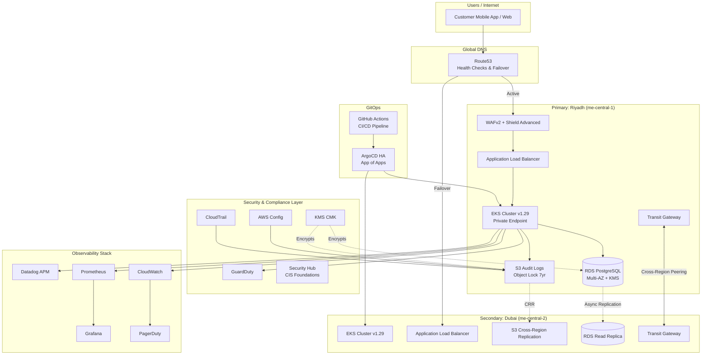

# SAMA VAULT PLATFORM

> **Production-Grade, Multi-Region AWS Infrastructure for Simulated Digital Banking**
> **SAMA Compliance-Ready | GitOps-Driven | Zero Hardcoded Values**

---

## Table of Contents
1, [What Is This Project?](#what-is-this-project)
2. [How This Works — Step by Step](#how-this-works--step-by-step)
3. [Behind the Scenes — What Actually Happens](#behind-the-scenes--what-actually-happens)
4. [The ONE File You Need to Edit](#the-one-file-you-need-to-edit)
5. [Project Overview](#project-overview)
6. [Architecture Overview](#architecture-overview)
7. [SAMA Compliance Mapping](#sama-compliance-mapping)
8. [Prerequisites](#prerequisites)
9. [Quick Start](#quick-start)
10. [Variable Configuration](#variable-configuration)
11. [Environment Strategy](#environment-strategy)
12. [Security Posture](#security-posture)
13. [Observability Guide](#observability-guide)
14. [Disaster Recovery](#disaster-recovery)
15. [Cost Optimization](#cost-optimization)
16. [Troubleshooting](#troubleshooting)
17. [Roadmap](#roadmap)

---

---

## What Is This Project?

### The Short Answer

This is a **ready-to-deploy cloud infrastructure** for a Saudi digital bank — built entirely with code, with zero clicking in the AWS console, and full compliance with Saudi Arabia's banking security rules (SAMA regulations).

### The Honest Explanation (No Jargon)

Imagine you want to build the tech behind an app like STC Pay or Urway. Before you can write a single line of banking app code, you need:

| What you need                    | What this project does                                       |
| -------------------------------- | ------------------------------------------------------------ |
| Servers to run your app          | Creates Kubernetes clusters on AWS (EKS) in Riyadh & Dubai   |
| A database to store transactions | Creates encrypted PostgreSQL (RDS) with automatic backups    |
| A firewall to block hackers      | Creates WAF — blocks all countries except Saudi Arabia & UAE |
| Security cameras (audit logs)    | Creates CloudTrail — records every single action forever     |
| A vault for encryption keys      | Creates KMS — every byte of data is encrypted                |
| Monitoring dashboards            | Creates Prometheus + Grafana — see everything in real-time   |
| Automatic deployments            | Creates ArgoCD — push to Git, cluster updates itself         |
| Disaster recovery                | Spins up everything in Dubai too, as a warm backup           |
| SAMA compliance proof            | Every control maps to a specific SAMA regulation number      |

### Why Code Instead of Clicking?

When you click through the AWS console to set things up, three bad things happen:

1. **You can't repeat it** — if you need a second environment (staging, prod), you click again, and probably forget something
2. **You can't prove it** — an auditor asks "is your audit log retention set to 7 years?" — you can't prove it without code
3. **You can't review it** — no one can check your work, no pull requests, no history

With this project, every setting is in a `.tfvars` file. You open a PR, someone reviews it, it gets applied automatically. Full history. Full audit trail. Full reproducibility.

### Who Built This For?

This is a **portfolio/reference implementation** for:

- Cloud Architects who want to show they can design fintech infrastructure
- DevOps/Platform Engineers targeting roles at STC Pay, Urway, Tamara, or traditional banks in KSA
- Compliance teams who want working code, not just policy documents
- Anyone studying how production banking infrastructure actually works

---


## How This Works — Step by Step

> Think of this like building a bank branch — but instead of bricks, you're using code. And instead of one branch, you're building two at the same time (one in Riyadh, one in Dubai), with security guards, cameras, vaults, and alarms all set up automatically.

Here's what happens from the moment you write code to the moment your banking app is live and safe:

---

### Step 1 — You write your configuration (not code, just settings)

You open ONE file:

```
terraform/environments/dev/terraform.tfvars
```

This file is like a form you fill in. You answer questions like:

- "What is this project called?" → `project_name = "saudi-bank-backend"`
- "Which region should be the main one?" → `primary_region = "me-central-1"` (Riyadh)
- "How many servers do I want?" → `desired_capacity = 2`
- "What's my alert email?" → `alert_email = "alerts@mybank.com"`

**You never touch any other file.** Everything else reads from this one file automatically.

---

### Step 2 — You run the pre-flight check

```bash
make preflight ENV=dev
```

The computer checks:

- ✅ Are you logged into AWS?
- ✅ Do you have Terraform installed?
- ✅ Do you have enough AWS quota (slots) to build this stuff?
- ✅ Is your AWS account allowed to create VPCs, EKS clusters, RDS databases?

If anything fails, it tells you exactly what to fix — before wasting any time.

---

### Step 3 — You create a safe place to save progress

```bash
make bootstrap ENV=dev
```

Terraform needs to remember what it has already built (so it doesn't build it twice). This step creates:

- An **S3 bucket** → like a save file for your infrastructure
- A **DynamoDB table** → like a lock that says "someone is working, don't touch"

Both of these are named automatically from your config file. You don't pick names manually.

---

### Step 4 — Phase 1: Build the physical cloud infrastructure

```bash
make infra ENV=dev
```

Now the real building begins. Terraform reads your config file and creates everything in AWS, in the right order:

1. **Networking first** → Creates the virtual data center (VPC), splits it into 3 zones (public/private/database), creates NAT Gateways so private servers can reach the internet
2. **Security next** → Creates the firewall (WAF), the threat detector (GuardDuty), the key vault (KMS), the audit system (CloudTrail)
3. **Compliance** → Creates the tamper-proof audit log bucket with 7-year lock, Config rules to monitor everything
4. **Database** → Creates PostgreSQL with encryption and automatic password rotation every 30 days
5. **EKS Cluster** → Creates the Kubernetes cluster (the brain that runs all your banking apps), fully private (no one can reach it from the internet directly)

⏱️ This takes about 20–40 minutes.

---

### Step 5 — Phase 2: Install the software on top

```bash
make k8s ENV=dev
```

Now that the servers exist, this installs the management tools inside the Kubernetes cluster:

1. **ArgoCD** → The robot that watches your Git repo and automatically pushes code changes to the cluster
2. **Prometheus** → Collects numbers (metrics) from every service, every second
3. **Grafana** → Turns those numbers into beautiful dashboards

---

### Step 6 — ArgoCD syncs your banking apps

```bash
make argocd-sync-dev
```

ArgoCD reads the Kubernetes YAML files from your Git repository and deploys them to the EKS cluster. Every time you push code to Git, ArgoCD automatically updates the running apps. **No manual deployment ever again.**

---

### Step 7 — Traffic flows safely to your users

From this point, here's what happens when a customer opens your banking app:

1. Customer's phone hits **Route53** (DNS — like a phone book that finds the right address)
2. Route53 sends them to **WAF** (firewall — checks if the request is from Saudi Arabia or UAE, blocks everything else)
3. WAF passes safe traffic to the **Load Balancer** (traffic director)
4. Load Balancer sends it to your **EKS pods** (the running app containers)
5. The app reads/writes to **RDS PostgreSQL** (the encrypted database)
6. Every single action is logged to **CloudTrail** → stored forever (7 years) in a tamper-proof S3 bucket

---

### Step 8 — Monitoring watches everything 24/7

- **Prometheus** scrapes metrics every 15 seconds from every pod
- **Grafana** shows dashboards: request rates, error rates, CPU usage, memory
- **CloudWatch** monitors the AWS services themselves
- **PagerDuty** wakes someone up at 3am if something breaks
- **GuardDuty** watches for hackers, suspicious logins, data exfiltration attempts

---

### Step 9 — If Riyadh dies, Dubai takes over automatically

- Route53 health checks ping the Riyadh load balancer every 30 seconds
- If Riyadh fails to respond → Route53 automatically switches DNS to the **Dubai** load balancer
- The Dubai EKS cluster is already running (ArgoCD keeps it in sync)
- The Dubai RDS replica gets promoted to a full writer database
- Customers experience a brief hiccup, then everything works again from Dubai

---

### ✅ Result: A running, secure, compliant banking backend

You filled in one config file. You ran 4 commands. You now have:

- Two Kubernetes clusters (Riyadh + Dubai)
- An encrypted PostgreSQL database
- A firewall that blocks non-Saudi/UAE traffic
- 7 years of tamper-proof audit logs
- Automatic threat detection
- Real-time monitoring dashboards
- GitOps deployment pipeline
- Automatic failover to Dubai if Riyadh goes down


## Behind the Scenes — What Actually Happens

> This section walks through every layer of the system, what each piece does, and why it exists. No hand-waving.

### Layer 1: Your Config File → Terraform Variables

When you run any `make` command, this is what happens under the hood:

```
terraform/environments/dev/terraform.tfvars
        ↓ (Terraform reads this)
terraform/variables.tf
        ↓ (defines types, validation rules)
terraform/main.tf
        ↓ (passes values to each module)
terraform/modules/networking/
terraform/modules/security/
terraform/modules/compliance/
terraform/modules/database/
terraform/modules/eks/
terraform/modules/observability/
terraform/modules/gitops/
        ↓ (each module creates real AWS resources)
Your running infrastructure in AWS
```

Nothing is hardcoded. `main.tf` just says `var.networking.cidr_blocks` — it always reads from your config file.

---

### Layer 2: Networking — The Virtual Data Center

When the networking module runs, it creates:

```
AWS Region (me-central-1, Riyadh)
└── VPC (10.0.0.0/16) — your private network in the cloud
    ├── Public Subnets (10.0.0.0/20)    ← Load Balancers live here
    ├── Private Subnets (10.0.16.0/20)  ← Your app pods live here
    └── Database Subnets (10.0.32.0/20) ← Database lives here (totally isolated)
```

- **3 Availability Zones** → if one AWS data center in Riyadh has a power cut, the other two keep running
- **NAT Gateway** → private pods can download software from the internet but no one from the internet can reach them directly
- **VPC Flow Logs** → every network packet that enters or leaves is logged (required by SAMA)

---

### Layer 3: Security — The Guards and Locks

The security module creates multiple independent defense systems:

**KMS (Key Management Service)**

- Like a master safe combination. Every piece of data — database records, S3 files, Kubernetes secrets — is encrypted with a key that only KMS controls
- Key rotates automatically every year
- Even if someone steals your hard drive from AWS (impossible, but hypothetically), the data is unreadable

**WAF (Web Application Firewall)**

- Sits in front of your load balancer
- Rejects all traffic from countries other than Saudi Arabia (`SA`) and UAE (`AE`) — configurable in your tfvars
- Blocks SQL injection attacks: someone trying to type `'; DROP TABLE users;--` into your login form → rejected
- Blocks XSS attacks: someone injecting JavaScript into your form fields → rejected
- Rate limits: if one IP makes more than 3,000 requests in 5 minutes → temporarily blocked

**GuardDuty**

- AWS's AI-powered threat detector
- Analyzes CloudTrail logs, VPC Flow Logs, DNS logs
- Raises alerts for: unusual API calls at odd hours, known malicious IP addresses, crypto mining behavior on your servers, data exfiltration attempts

**Security Hub**

- Aggregates all security findings from GuardDuty, Config, and Inspector into one dashboard
- Scores your account against CIS Foundations Benchmark (the gold standard for cloud security)

---

### Layer 4: Compliance — The Paper Trail That Can't Be Erased

The compliance module creates:

**CloudTrail**

- Records every single AWS API call: who called it, from where, when, what parameters, what response
- Example: "User `terraform` called `CreateSecurityGroup` at 14:32:07 from IP `1.2.3.4`"
- Stored in S3 with **Object Lock in COMPLIANCE mode** → no one — not even the AWS root account — can delete or modify these logs for 7 years
- This directly satisfies SAMA requirements 3.2.1 and 3.2.2

**AWS Config**

- Continuously monitors your AWS resources
- If someone manually changes a security group rule (bypassing Terraform), Config detects it and raises a finding
- Records a full history of every resource configuration over time

**S3 Bucket Lifecycle**

- Logs stay in S3 Standard for the first 90 days (fast access)
- After 90 days → moves to Glacier (cheaper, slower)
- After 180 days → moves to Deep Archive (cheapest storage)
- After 7 years → deleted (SAMA minimum met)

---

### Layer 5: Database — Where the Money Data Lives

The database module creates:

**RDS PostgreSQL**

- Multi-AZ in production: one primary database + one standby. If the primary fails, AWS automatically promotes the standby in ~60 seconds
- Encrypted at rest using the KMS key created in the security module
- Automatic backups every day, retained for 7 days (dev) or 35 days (prod)
- Performance Insights: see exactly which SQL query is slow and why

**Secrets Manager**

- The database password is never in your code or config files
- Secrets Manager holds the password and rotates it automatically every 30 days
- Your EKS pods retrieve the password at runtime — they never store it

---

### Layer 6: EKS — The Kubernetes Cluster (Where Your App Runs)

The EKS module creates:

**The Control Plane (private)**

- The Kubernetes API server is only accessible from within the VPC — not from the internet
- To manage the cluster, you go through a bastion host (a jump server) in the public subnet
- This means even if someone has your kubeconfig file, they can't use it from home — they need VPN or bastion access first

**Node Groups (worker servers)**

- Dev: `t3.medium` Spot instances (cheap, can be interrupted — fine for dev)
- Prod: On-Demand instances (stable, never interrupted)
- Auto-scaling: Kubernetes automatically adds nodes when load increases, removes them when load drops

**IRSA (IAM Roles for Service Accounts)**

- Instead of giving every pod full AWS permissions, each specific workload gets only what it needs:
  - The load balancer controller: can only touch load balancers
  - External DNS: can only modify Route53 records
  - The app pods: no AWS permissions at all unless explicitly granted
- This is called "least privilege" — even if a pod is hacked, the blast radius is minimal

---

### Layer 7: Observability — The Control Room

**Prometheus (metric collector)**

- Every pod exposes a `/metrics` endpoint
- Prometheus scrapes all of them every 15 seconds
- Stores time-series data: "at 14:32:00, pod X used 342MB RAM and handled 1,203 req/sec"

**Grafana (dashboard)**

- Reads from Prometheus and draws graphs
- Pre-built dashboards: node health, pod restarts, request latency (p50/p95/p99), error rates, database connections
- Access via port-forward: `kubectl port-forward svc/grafana -n monitoring 3000:80`

**CloudWatch Container Insights**

- AWS's own monitoring for EKS
- Captures pod logs automatically — no log configuration needed in your apps
- Logs Insights lets you search logs with SQL-like queries

**PagerDuty**

- When a CloudWatch alarm fires (e.g., error rate > 5%, or CPU > 80%), it calls/texts/emails the on-call engineer
- Configured via your tfvars: `pagerduty_service_name = "banking-prod-alerts"`

---

### Layer 8: GitOps — How Code Gets to Production

**ArgoCD (the deployment robot)**

- Watches your Git repository (the URL you put in `gitops_repo_url`)
- Every time someone merges a PR that changes a Kubernetes YAML file, ArgoCD sees it within ~3 minutes
- ArgoCD compares the desired state (Git) with the actual state (running cluster)
- If they differ → ArgoCD applies the changes automatically
- `enable_self_heal = true` → if someone manually `kubectl apply`s something wrong, ArgoCD reverts it within minutes

**GitHub Actions (CI/CD pipeline)**

- When you push code → Actions run automatically:
  1. Build the Docker image
  2. Run SAST (SonarQube) — scans your code for security vulnerabilities
  3. Run Trivy — scans the Docker image for known CVEs
  4. Run `terraform plan` — shows what infrastructure changes will happen
  5. If all passes → merge PR → ArgoCD deploys

---

### Layer 9: Disaster Recovery — What Happens When Riyadh Goes Down

| Event                                    | Automatic or Manual         | Time        |
| ---------------------------------------- | --------------------------- | ----------- |
| Route53 detects Riyadh ALB unhealthy     | Automatic                   | ~30 seconds |
| DNS switches to Dubai ALB                | Automatic                   | ~60 seconds |
| Dubai EKS cluster serves traffic         | Automatic (already running) | Immediate   |
| DBA promotes Dubai RDS replica to writer | Manual                      | ~15 minutes |
| Full DR verified via smoke tests         | Manual                      | ~30 minutes |

**RTO (Recovery Time Objective): < 4 hours**
**RPO (Recovery Point Objective): < 1 hour** (RDS replication lag)

---

## The ONE File You Need to Edit

> The entire project is designed so that **you only ever need to edit one file per environment**. Everything else reads from it automatically. No hardcoded values. Ever.

The file is:

```
terraform/environments/dev/terraform.tfvars
```

(and similarly `staging/terraform.tfvars` and `prod/terraform.tfvars` for those environments)

### Minimum Changes Before Running

Only **5 values** need to be changed from their defaults to make this yours:

```hcl
# 1. Your project name (used in ALL resource names)
project_name = "my-bank-name"

# 2. Update common_tags with your team info
common_tags = {
  Owner      = "your-name"
  CostCenter = "your-team"
}

# 3. Your Git repo URL (ArgoCD will watch this)
gitops = {
  gitops_repo_url = "https://github.com/YOUR-ORG/YOUR-REPO.git"
  ...
}

# 4. A globally unique S3 bucket name for Terraform state
state_backend = {
  bucket_name         = "my-bank-name-tfstate-dev"   # must be globally unique
  dynamodb_table_name = "my-bank-name-tflock-dev"
  ...
}

# 5. Your alert email
observability = {
  alert_email = "your-email@example.com"
  ...
}
```

**That's it.** Every other value has a sensible default. Every other file in the project reads from this one file. No hunting through modules, no grepping for IP addresses, no editing multiple files.

### How "Zero Hardcoded Values" Works

```
terraform/environments/dev/terraform.tfvars   ← you set values HERE
        ↓
terraform/variables.tf                         ← defines what types are allowed + validates
        ↓
terraform/main.tf                              ← passes var.xyz to each module
        ↓
terraform/modules/networking/main.tf           ← uses var.cidr_blocks (no literal IPs)
terraform/modules/security/main.tf             ← uses var.allowed_countries (no literal "SA","AE")
terraform/modules/eks/main.tf                  ← uses var.cluster_version (no literal "1.29")
```

If you want to change the Kubernetes version from `1.29` to `1.30`, you change it **once** in `terraform.tfvars`. Every module picks it up. No search-and-replace across 20 files.

### Variable Validation

The variables are not just passed through blindly. `variables.tf` validates every input:

```hcl
validation {
  condition     = var.compliance.audit_retention_years >= 7
  error_message = "SAMA compliance requires a minimum of 7 years audit retention."
}
```

If you accidentally type `audit_retention_years = 3`, Terraform will **refuse to run** and tell you why. Safety built in.

---

## Project Overview

This repository contains a **complete, production-ready, multi-region AWS infrastructure project** designed for a simulated digital banking backend operating in the Kingdom of Saudi Arabia (KSA). It is architected from the ground up to meet the stringent requirements of the **Saudi Arabian Monetary Authority (SAMA)** Cyber Security Framework, while remaining fully deployable, auditable, and maintainable by modern Platform Engineering and DevOps teams.

### What Is This Project?

This project is an **Infrastructure-as-Code (IaC) blueprint** that provisions an entire cloud-native digital banking platform across multiple AWS regions (Riyadh `me-central-1` and Dubai `me-central-2` for cross-region resiliency). It encompasses:

- **Networking**: Multi-AZ VPCs with 3-tier subnet isolation, Transit Gateway cross-region connectivity, and Route53 health checks.
- **Compute**: Amazon EKS v1.29+ with managed node groups, IRSA (IAM Roles for Service Accounts), and private endpoint-only access.
- **Security**: WAFv2 with financial-sector rule sets, AWS Shield Advanced, GuardDuty, Security Hub, and KMS CMK envelope encryption.
- **Compliance**: Centralized CloudTrail and AWS Config with S3 Object Lock (COMPLIANCE mode) enforcing 7-year immutable audit retention.
- **Database**: Multi-AZ RDS PostgreSQL 15+ with encryption, Secrets Manager auto-rotation, and performance insights.
- **Observability**: Prometheus, Grafana, CloudWatch Container Insights, Datadog APM, and PagerDuty integrations.
- **GitOps**: ArgoCD with HA Redis Sentinel, App of Apps pattern, and environment-specific ApplicationSets.

### Why Use This Approach?

Traditional infrastructure provisioning is manual, error-prone, and nearly impossible to audit at scale. This project addresses those challenges through:

- **Variable-Driven Configuration**: Every parameter is externalized into `terraform.tfvars` files. There are zero hardcoded values in any module, enabling instant environment replication (dev → staging → prod) with full confidence.
- **Modular Architecture**: Each concern (networking, security, compliance, etc.) is encapsulated in its own Terraform module. Teams can upgrade, patch, or replace individual modules without cascading changes.
- **Compliance by Design**: SAMA requirements are not retrofitted; they are embedded into the architecture. Audit logs, encryption, access controls, and retention policies are provisioned automatically.
- **GitOps Native**: Infrastructure and application delivery are unified in Git. ArgoCD ensures the live cluster state matches the desired state declared in version control, eliminating configuration drift.
- **Cost Conscious**: Dev environments use Spot instances, while production leverages right-sized On-Demand and Savings Plans recommendations. Resource tagging is enforced for FinOps chargeback.

### Who Is This For?

This project is ideal for:

- **Cloud Architects** designing banking or fintech platforms in the Middle East.
- **DevOps / Platform Engineers** building internal developer platforms (IDPs) with strict compliance mandates.
- **Compliance Officers** seeking verifiable, code-based evidence of control implementation.
- **Recruiters & Hiring Managers** evaluating candidates for STC Pay, Urway, Tamara, or traditional bank IT departments in Riyadh and Dubai.

---

## Architecture Overview

The architecture follows an **active-passive multi-region design** optimized for the Saudi financial sector. The primary region (Riyadh) handles live traffic, while the secondary region (Dubai) serves as a warm standby for disaster recovery.

### Mermaid Diagram



### Data Flow

1. **Ingress**: Customer requests hit Route53, which routes to the Riyadh ALB. Route53 health checks monitor endpoint health; if Riyadh fails, DNS fails over to Dubai.
2. **Edge Security**: WAFv2 inspects all HTTP(S) traffic, blocking SQL injection, XSS, and requests from non-KSA/UAE IPs. AWS Shield Advanced protects against DDoS.
3. **Compute**: Traffic terminates at the ALB and is forwarded to EKS pods running in private subnets. EKS is private-endpoint only; no direct internet access to the Kubernetes API.
4. **Data**: Application pods connect to RDS PostgreSQL in database subnets. All data at rest is encrypted with KMS CMK. Secrets (DB credentials) are rotated automatically every 30 days via Secrets Manager.
5. **Audit**: Every AWS API call is recorded by CloudTrail and stored in an S3 bucket with Object Lock COMPLIANCE mode, preventing deletion or overwrite for 7 years.
6. **Observability**: Prometheus scrapes metrics, Grafana renders dashboards, Datadog collects APM traces, and CloudWatch alarms trigger PagerDuty incidents for on-call response.
7. **Delivery**: Developers push code to GitHub. Actions run build, SAST (SonarQube), container scan (Trivy), and Terraform plan. ArgoCD syncs the new manifests to the cluster.

---

## SAMA Compliance Mapping

The Saudi Arabian Monetary Authority (SAMA) Cyber Security Framework mandates specific controls for financial institutions. The following table maps each Terraform resource to its simulated SAMA requirement:

| SAMA Requirement | Control Description              | Terraform Resources                                                                                                |
| ---------------- | -------------------------------- | ------------------------------------------------------------------------------------------------------------------ |
| **3.2.1**        | Audit Logs Retention (7 Years)   | `aws_cloudtrail.main`, `aws_s3_bucket.audit`, `aws_s3_bucket_lifecycle_configuration.audit`                        |
| **3.2.2**        | Audit Log Integrity              | `aws_s3_bucket_object_lock_configuration.audit`, `aws_s3_bucket_policy.audit_readonly_root`                        |
| **3.3.1**        | Encryption at Rest               | `aws_kms_key.main`, `aws_db_instance.main.storage_encrypted`, `aws_s3_bucket_server_side_encryption_configuration` |
| **3.3.2**        | Encryption in Transit            | `aws_s3_bucket_policy.audit` (TLS enforcement), ALB HTTPS listeners                                                |
| **3.4.1**        | Access Control (Least Privilege) | IRSA roles (`aws_iam_role.alb_controller`, `aws_iam_role.external_dns`), `aws_iam_role.config`                     |
| **3.4.2**        | Privileged Access Monitoring     | `aws_guardduty_detector.main`, `aws_securityhub_account.main`, `aws_cloudwatch_metric_alarm.failed_logins`         |
| **3.5.1**        | Network Segmentation             | `aws_subnet.public`, `aws_subnet.private`, `aws_subnet.database`, `aws_security_group.database`                    |
| **3.5.2**        | Network Intrusion Detection      | `aws_wafv2_web_acl.main`, `aws_guardduty_detector.main`                                                            |
| **3.6.1**        | Vulnerability Management         | GitHub Actions Trivy scan, `aws_securityhub_standards_subscription.fsbp`                                           |
| **3.7.1**        | Backup & Recovery                | `aws_db_instance.main.backup_retention_period`, S3 versioning, DynamoDB PITR                                       |
| **3.8.1**        | Change Management                | GitOps via ArgoCD, Terraform state locking (`aws_dynamodb_table`), GitHub PR reviews                               |
| **3.9.1**        | Incident Response                | PagerDuty integration, CloudWatch alarms, GuardDuty findings export                                                |
| **3.10.1**       | Business Continuity              | Multi-AZ RDS, multi-region EKS, Route53 failover, cross-region S3 replication                                      |

---

## Prerequisites

Before deploying this infrastructure, ensure the following tools are installed and configured:

| Tool       | Minimum Version | Purpose                                |
| ---------- | --------------- | -------------------------------------- |
| AWS CLI    | 2.13+           | Interact with AWS APIs                 |
| Terraform  | 1.7.0+          | Infrastructure provisioning            |
| kubectl    | 1.29+           | Kubernetes cluster management          |
| Helm       | 3.13+           | Kubernetes package management          |
| GitHub CLI | 2.30+           | GitHub Actions & repository management |
| jq         | 1.6+            | JSON parsing in shell scripts          |
| tflint     | 0.50+           | Terraform linting                      |
| Checkov    | 3.0+            | Policy-as-code security scanning       |

### AWS Account Requirements

- Access to `me-central-1` (Riyadh) and `me-central-2` (Dubai) regions.
- Service quotas: minimum 5 VPCs, 3 EKS clusters, and 5 NAT Gateways per region.
- IAM permissions to create roles, policies, KMS keys, VPCs, EKS clusters, RDS instances, and S3 buckets.
- An OIDC identity provider configured for GitHub Actions (see `policies/oidc-trust-policies.json`).

---

## Quick Start

Follow these five steps to go from `git clone` to a running infrastructure:

### Step 1: Clone the Repository

```bash
git clone https://github.com/your-org/saudi-bank-backend.git
cd saudi-bank-backend
```

### Step 2: Configure Variables

Edit **only** `terraform/environments/dev/terraform.tfvars`. At minimum, update:

- `project_name`
- `common_tags` (Owner, CostCenter)
- `gitops.gitops_repo_url` (point to your Git repo)
- `state_backend.bucket_name` (globally unique S3 bucket name)
- `observability.alert_email`

> **You do not need to edit any other file in the project.**

### Step 3: Run Pre-Flight Checks

```bash
make preflight ENV=dev
```

This validates AWS credentials, tool versions, and service quotas.

### Step 4: Bootstrap the Backend

```bash
make bootstrap ENV=dev
```

This idempotently creates the S3 bucket and DynamoDB table for Terraform state.

### Step 5: Deploy (Two-Phase)

Because Kubernetes providers require a live cluster endpoint, deployment is split into two phases:

**Phase 1: AWS Infrastructure**

```bash
make infra ENV=dev
```

This creates VPC, subnets, EKS cluster, RDS, KMS, WAF, CloudTrail, and S3 buckets.

**Phase 2: Kubernetes Addons**

```bash
make k8s ENV=dev
```

This deploys ArgoCD, Prometheus, Grafana, and other cluster addons via Helm.

**Combined (convenience target):**

```bash
make deploy-dev
```

For staging and production:

```bash
make deploy-staging ENV=staging
make deploy-prod ENV=prod
```

**Note**: Production requires manual approval via the Makefile prompt and GitHub Environment protection rules.

---

## Variable Configuration

All variables are defined in `terraform/variables.tf` and overridden per environment in `terraform/environments/<env>/terraform.tfvars`.

| Variable                            | Type           | Description                      | Example                              |
| ----------------------------------- | -------------- | -------------------------------- | ------------------------------------ |
| `project_name`                      | `string`       | Project name for resource naming | `"saudi-bank-backend"`               |
| `environment`                       | `string`       | Deployment environment           | `"dev"`, `"staging"`, `"prod"`       |
| `primary_region`                    | `string`       | Primary AWS region               | `"me-central-1"`                     |
| `secondary_region`                  | `string`       | DR region                        | `"me-central-2"`                     |
| `networking.cidr_blocks`            | `map(string)`  | VPC and subnet CIDRs             | `{ vpc = "10.0.0.0/16" }`            |
| `networking.availability_zones`     | `list(string)` | AZs for subnet distribution      | `["me-central-1a", "me-central-1b"]` |
| `eks.cluster_version`               | `string`       | Kubernetes version               | `"1.29"`                             |
| `eks.node_instance_types`           | `list(string)` | EC2 instance types for nodes     | `["t3.medium"]`                      |
| `eks.desired_capacity`              | `number`       | Desired node count               | `3`                                  |
| `security.allowed_countries`        | `list(string)` | ISO country codes for WAF        | `["SA", "AE"]`                       |
| `security.waf_rate_limit`           | `number`       | Requests per 5 min per IP        | `3000`                               |
| `security.enable_shield_advanced`   | `bool`         | Enable AWS Shield Advanced       | `true` (prod)                        |
| `compliance.audit_retention_years`  | `number`       | Audit log retention              | `7`                                  |
| `compliance.enable_object_lock`     | `bool`         | Enable S3 Object Lock            | `true`                               |
| `database.db_instance_class`        | `string`       | RDS instance class               | `"db.r6g.xlarge"`                    |
| `database.backup_retention`         | `number`       | RDS backup retention days        | `35`                                 |
| `observability.alert_email`         | `string`       | Alert recipient email            | `"alerts@example.com"`               |
| `gitops.gitops_repo_url`            | `string`       | ArgoCD source repository         | `"https://github.com/org/repo.git"`  |
| `gitops.argocd_version`             | `string`       | ArgoCD Helm chart version        | `"5.51.6"`                           |
| `state_backend.bucket_name`         | `string`       | Terraform state S3 bucket        | `"my-tfstate-bucket"`                |
| `state_backend.dynamodb_table_name` | `string`       | State lock table                 | `"my-tflock-table"`                  |

**Validation**: Every variable includes validation blocks (e.g., CIDR format, environment whitelist, minimum retention). Terraform will fail fast with descriptive errors if invalid values are provided.

---

## Environment Strategy

This project supports three environments: **dev**, **staging**, and **prod**.

### Isolation Model

Environments are isolated using a **combination of separate AWS accounts and VPC-level segregation**:

- **Recommended**: Use separate AWS accounts per environment (dev account, staging account, prod account). This provides the strongest blast-radius containment.
- **Alternative** (for smaller teams): Use the same AWS account but distinct VPCs with strict IAM boundaries. Each environment has its own:
  - VPC and subnet CIDR ranges (no overlap)
  - EKS cluster
  - RDS instance
  - S3 buckets (state + audit)
  - DynamoDB lock table

### Promotion Path

```
Dev (auto-deploy) -> Staging (manual approval) -> Prod (two-person approval + 24h soak)
```

- **Dev**: Every merge to `main` auto-deploys. Spot instances minimize cost.
- **Staging**: Requires manual approval in GitHub Actions. Mirrors production sizing.
- **Production**: Requires two reviewers and a 24-hour staging stability observation.

### Backend Separation

Each environment has its own S3 state bucket and DynamoDB lock table, preventing state corruption and enabling parallel environment management.

---

## Security Posture

Security is not an afterthought; it is woven into every layer of this architecture.

### Defense in Depth

1. **Perimeter**: WAFv2 geo-blocks non-KSA/UAE traffic, mitigates SQLi/XSS, and rate-limits IPs.
2. **Network**: 3-tier VPC isolation (Public / Private / Database). Private subnets have no direct internet egress except via NAT Gateway. Database subnets are completely isolated.
3. **Compute**: EKS private endpoint only. Bastion host is required for administrative kubectl access. Nodes use IAM roles with least-privilege policies.
4. **Identity**: IRSA assigns fine-grained IAM roles to individual Kubernetes service accounts. No node-level AWS credentials are mounted into pods.
5. **Data**: All data at rest is encrypted with KMS CMK. RDS uses envelope encryption. S3 buckets enforce TLS-only transport.
6. **Audit**: CloudTrail logs every API call. GuardDuty detects anomalous behavior. Security Hub aggregates findings against CIS benchmarks.

### IRSA (IAM Roles for Service Accounts)

Instead of granting broad EC2 instance profile permissions to all pods, each workload receives its own IAM role:

- **ALB Controller**: Can manage ELBs, target groups, and security groups.
- **External-DNS**: Can modify Route53 hosted zones.
- **Cert-Manager**: Can create Route53 DNS records for ACME challenges.
- **Cluster Autoscaler**: Can scale Auto Scaling Groups tagged for the cluster.

No role has `*:*` permissions. All policies are scoped to the minimum required actions.

### Encryption Strategy

- **At Rest**: KMS CMK (multi-region in prod) encrypts EKS secrets, RDS storage, EBS volumes, and S3 objects.
- **In Transit**: TLS 1.2+ enforced on ALBs, S3 bucket policies, and API endpoints.
- **Key Rotation**: KMS automatic key rotation is enabled.

---

## Observability Guide

### Accessing Dashboards

After deployment, retrieve access credentials and endpoints:

| Tool           | Access Method | Command                                                                        |
| -------------- | ------------- | ------------------------------------------------------------------------------ |
| **Grafana**    | Port-forward  | `kubectl port-forward svc/kube-prometheus-stack-grafana -n monitoring 3000:80` |
| **ArgoCD**     | Port-forward  | `make argocd-login`                                                            |
| **CloudWatch** | AWS Console   | Navigate to CloudWatch > Dashboards                                            |
| **PagerDuty**  | Web           | Log in to your PagerDuty tenant                                                |

### Sample Alert Queries

**High CPU in EKS Nodes** (PromQL):

```promql
100 - (avg by(instance) (irate(node_cpu_seconds_total{mode="idle"}[5m])) * 100) > 80
```

**5xx Errors on ALB** (CloudWatch Metrics):

```
Namespace: AWS/ApplicationELB
MetricName: HTTPCode_Target_5XX_Count
Statistic: Sum
Period: 60
Threshold: > 10
```

**Failed Login Attempts** (CloudWatch Logs Insights):

```sql
fields @timestamp, @message
| filter @message like /Failed login/
| stats count() as failed_attempts by bin(5m)
| filter failed_attempts > 5
```

### Datadog APM

The Datadog agent runs as a DaemonSet. It pulls the API key from AWS Secrets Manager (referenced by `var.observability.datadog_api_key_secret_arn`). Deploy the agent via the Helm chart in `kubernetes/` after creating the secret.

---

## Disaster Recovery

### RTO / RPO Targets

| Metric                             | Target    | Implementation                                                   |
| ---------------------------------- | --------- | ---------------------------------------------------------------- |
| **RTO** (Recovery Time Objective)  | < 4 hours | Multi-region EKS, Route53 failover, automated ArgoCD sync to DR  |
| **RPO** (Recovery Point Objective) | < 1 hour  | RDS cross-region read replica, S3 Cross-Region Replication (CRR) |

### Failover Procedure

1. **Detection**: Route53 health checks detect primary region failure.
2. **DNS Failover**: Route53 automatically updates DNS to point to the Dubai ALB.
3. **Database Promotion**: Promote the Dubai RDS read replica to standalone writer.
4. **Cluster Sync**: ArgoCD ensures the DR EKS cluster is running the same application version.
5. **Verification**: Run smoke tests against the Dubai endpoints.

### Backup Verification

- **Monthly**: Restore RDS snapshot to a temporary instance and validate connectivity.
- **Quarterly**: Perform a full DR drill, including DNS cutover and database promotion.

---

## Cost Optimization

### Right-Sizing

- **Dev**: Uses Spot instances for EKS node groups (configurable via `capacity_type`).
- **Staging**: Mirrors production topology but with smaller instance classes.
- **Production**: Uses On-Demand for stability, with Karpenter for dynamic scaling.

### Savings Plans

For production workloads with predictable baselines, purchase Compute Savings Plans for 1- or 3-year terms to reduce EC2 costs by up to 72%.

### Resource Tagging

All resources are tagged with `Project`, `Environment`, `ManagedBy`, `Owner`, and `CostCenter`. Use AWS Cost Explorer and tagging policies to allocate costs by team and environment.

### Lifecycle Policies

- S3 audit logs transition to Glacier after 90 days and Deep Archive after 180 days.
- ECR lifecycle policies automatically delete untagged images older than 30 days.

---

## Troubleshooting

### Quota Limits

**Error**: `VpcLimitExceeded`
**Fix**: Request a quota increase via AWS Service Quotas console or run:

```bash
aws service-quotas request-quota-increase --service-code ec2 --quota-code L-1194D1C8 --desired-value 10
```

### IRSA Misconfiguration

**Error**: `WebIdentityErr: failed to retrieve credentials`
**Fix**: Verify the service account annotation matches the IAM role ARN:

```bash
kubectl get sa -n kube-system aws-load-balancer-controller -o yaml
```

Ensure the OIDC provider thumbprint is up to date.

### ArgoCD Sync Failures

**Error**: `ComparisonError: failed to get resource`
**Fix**: Check cluster RBAC and ArgoCD application destination namespace:

```bash
kubectl logs -n argocd deployment/argocd-application-controller
```

Ensure the Application's `project` and `destination.server` are correct.

### Terraform State Lock

**Error**: `Error acquiring the state lock`
**Fix**: If a previous run crashed, force-unlock after confirming no active runs:

```bash
cd terraform && terraform force-unlock <LOCK_ID>
```

---

## Roadmap

This project is designed to evolve. Planned enhancements include:

1. **AWS Fargate**: Migrate non-critical workloads to Fargate profiles for serverless container execution.
2. **Chaos Engineering**: Integrate AWS Fault Injection Simulator (FIS) to test AZ failures, API throttling, and network blackholes.
3. **Service Mesh**: Deploy Istio or AWS App Mesh for mTLS between microservices and advanced traffic management.
4. **FinOps Dashboard**: Build a Grafana dashboard using CUR (Cost and Usage Report) data exported to Athena.
5. **Policy as Code**: Expand OPA (Open Policy Agent) gatekeeper policies for Kubernetes admission control.
6. **Multi-Cloud DR**: Evaluate Azure or GCP as a tertiary DR target for extreme resilience.

---

## License

This project is provided as an educational and portfolio reference. Adapt it for your organization with appropriate security reviews and penetration testing before production use in regulated environments.

---

**Built with precision for the Saudi financial sector.**
